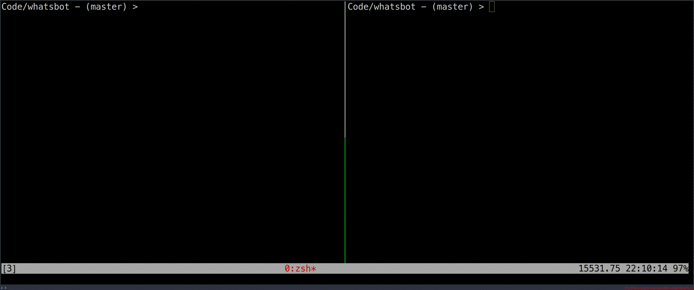

<div align="center">

# WhatzBot

## The best WhatsApp Bot framework out there

Create a WhatsApp bot **without any browser simulation**. Use it like an cli
with a clean code architecture.

</div>

## Run the example (Send messages from terminal)
There is an example that allows you to query your contact informations and to send
a message to one of your contacts.
It's located in src/example.ts.



To run it simply do following:

```sh
$ npm install
$ npm run example:start
```

After that a QR-Code will pop up on your terminal which needs to be scanned by
your WhatsApp application. Like you would do with **WhatsApp Web**.

### Script to send the message
A fzf thingy message sender written in bash. Its located in `tools/wa.sh`.

**Usage**
1. Start the example with `npm run example:start`
2. Scan the qr code and wait until the log shows `X contacts found...`
3. Run `sh tools/wa.sh` and you should see a list of contacts popping up **YOU NEED fzf AND jq INSTALLED**
4. Search for a contact and hit enter
5. Enter your message and hit enter, it will be sent to the client

## Write your own bot

```sh
$ npm install whatzbot
```

```typescript
import { Bot, createConnection, IMessage } from 'whatzbot';

export class EchoBot extends Bot {

	onMessageReceived(msg: IMessage) {
		if (msg.sender !== 'me')
			this.sendMessage(msg.message, msg.sender);
	}
}

async function start() {
	const connection = await createConnection({
		logLevel: 'info',
		pinnedChatsFirst: true,
		sessionFile: './auth_info.json'
	});
	const mBot = new EchoBot(connection);
	mBot.listen();
}
start();
```


<div align="center">

Made with love and Typescript

</div>
